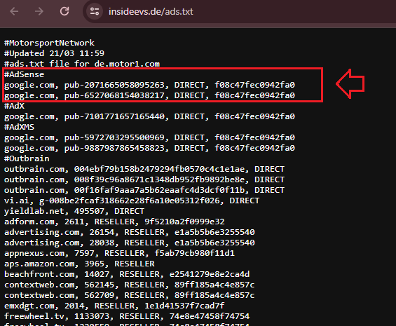
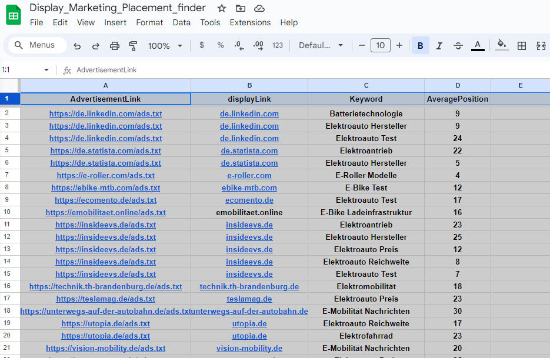
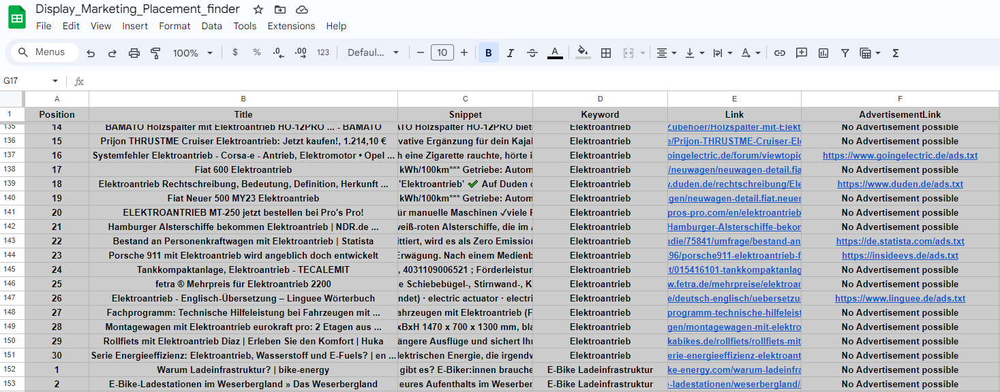

# Welcome to my self-designed and realised digital marketing project

## This Project Tackles a Real World Digital Marketing Problem and identifies Websites which are Part of a Advertising Network. 
### On Google/ Microsoft Ads and many other Platforms you can choose Websites where your Display Ads are shown to potential Customers. 

You do this, because if you go broad or only for Target Groups Settings in Display Ads,
it will Place your Ads on very many unrelevant Websites (Spam Websites)
Which generates a lot of Clickbait, Bot Traffic or other Clicks,
which cost you tons of money over the year and have literally 0 value. 
Next good Thing with the Programmable Search Engine is, that you can restrict every Search Query on Things like.
Country of the Website, Langage Article written in, or Browser Language Settings

## Domain Knowledge which would be nice to have for understanding the Project:
- Know a bit of how Display Ads work and where and how to book them in
- Know how to restrict Display Placements to specific Websites which are relevant for your Company
- Know something about Websites/ Web-Crawler/ and where Commercial Websites store important Information
- Know a bit about Google Cloud and make a easy Setup to authorize your API Requests 
- Websites with the /ads.txt prefix always Store this in the Root Directory of the Website
- the /ads.txt helps crawlers and Advertisers to see, who and which Ad Platforms are able to book Placements on this Website (Google Ads, Adform, Stroer.. and many more)
- If you want a easy time search in the /ads.txt for terms like "google.com,pub-5786819153313314,DIRECT,f08c47fec0942fa0" 
- This means you can directly publish Ads on this Website over your Google Ads Account, 
where your other campaigns run (for sure you can do this for any other Advertise Platform too, but Google Ads is by far the biggest Ads Distributor)


### The Structure of a /ads.txt File (Info for Webcrawlers
)
This means you can directly Book Ads on this Website over Google Ads


you can as well use any other Advertisement Network mentioned here and book Ads over their Platform

## What you need to successfully run this Program on your Machine
- Some Knowledge about Google Cloud and at least a "free" Google Cloud Account ("free" is 100 API calls per day (no credit card required))
- Set up your own Programmable Search Engine and get your API Key and Search Engine ID: https://developers.google.com/custom-search/v1/introduction?hl=de  (easy to follow Setup)
- Make a Project in your Google Cloud Account and Activate Google Sheets and Custom Search API https://cloud.google.com/?hl=de   
- Get the API Key and Credential file from your Google Cloud Account  (you could skip the Google Sheets API if you write your results into an csv at the end of the project)

## The Advantage you get over your Competitors when using this Method
- Safe tons of money over the year, which would be caused due to missplacement when Booking Display Ads over Google Ads with default settings
- Restrict your Results to your Target Market (for e.g. Germany) and dont publish in foreign countries or language setting of the Website (further cost safing)
- Avoid Bot Clicks, Clickbait and Placements beneath War, negative Sentiment etc.
- Safe loads of Workforce and Time, which had to identify this Sites by Hand for each Branch and Customer (Very Good Script for Agencys)
- Extract the highly relevant News Websites for your Keywords Place 1-30 in Google (first 3 Google Sites) for every Keyword


## Further Possible Improvements to the Project
- If you have a Cloud Account with unlimited API Calls you can increase the amout of Keywords in this Project from 30 to infinite
- If you search for specific Ad-Networks you can directly extract a text with regex from /ads.txt
- for example u only want Websites where u can directly book ads over Google Ads Platform you would look for sth like this "google.com,pub-5786819153313314,DIRECT,f08c47fec0942fa0"
- You can Programm a Interface for non technical People to just Throw in the Keywords over a uploaded File or a Website 


## Skills and Tools i used for this Project
- Python Programming
- Webscraping with CustomSearch JSON API
- Web Requests and Knowledge about HTTP Requests
- Data Manipulation with Pandas
- Google Cloud Console
- API's 
- Google Sheets API
- Digital Marketing Knowledge (Real World Problem)

## Look at the Final Google Sheet for this Project

[Display_Marketing_Placement_finder](https://docs.google.com/spreadsheets/d/1Bamyn-yCTcjzsXyTCsrj2r9wSLgXI9_HG66o2dpm0Co/edit#gid=0)

Notice the 2 Sheets in this File.

Ads Placement gives you 1 Entry for each Keyword and the Average Position for the Site on this specific Keyword (if more than 1 Placements in top 30)

Detailed Data gives you a bit more Data for further Analysis about the Topic

This is the Summary, here you can Extract Advertising Websites



Here you get more Detailed Data and find the specific Article for the Keyword and Position of the Site:




## Set up your Environment

Please make sure you have forked the repo and set up a new virtual environment. For this purpose you can use the following commands:

The added [requirements file](requirements.txt) contains all libraries and dependencies we need to execute the hands-on notebook.

*Note: If there are errors during environment setup, try removing the versions from the failing packages in the requirements file.

### **`macOS`** type the following commands : 


- Install the virtual environment and the required packages by following commands:

    ```BASH
    pyenv local 3.11.3
    python -m venv .venv
    source .venv/bin/activate
    pip install --upgrade pip
    pip install -r requirements.txt
    ```
### **`WindowsOS`** type the following commands :

- Install the virtual environment and the required packages by following commands.

   For `PowerShell` CLI :

    ```PowerShell
    pyenv local 3.11.3
    python -m venv .venv
    .venv\Scripts\Activate.ps1
    pip install --upgrade pip
    pip install -r requirements.txt
    ```

    For `Git-bash` CLI :
  
    ```BASH
    pyenv local 3.11.3
    python -m venv .venv
    source .venv/Scripts/activate
    pip install --upgrade pip
    pip install -r requirements.txt
    ```
     **`Note:`**
    If you encounter an error when trying to run `pip install --upgrade pip`, try using the following command:

    ```Bash
    python.exe -m pip install --upgrade pip
    ```